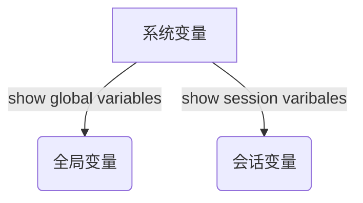

#### 一. MYSQL基础知识

##### 1.mysql登录命令

mysql -h ip -P 端口 -u 用户名 -p

##### 2.查看数据库版本

mysql --version/mysql -V

select version();

##### 3.常用命令

show databases;

use database_test;

show tables from database_test;

desc table_test;

show create table table_test;

select database(); 查看当前所在库

show engines; 查看当前mysql支持的存储引擎

show variables; 查看系统变量及其值

show variables like '%wait_timeout%';

##### 4.mysql语法规范

1.不区分大小写,但建议关键字大写，表名与列名小写

2.每条命令最好用英文分号结尾

3.每条命令根据需要,可以进行缩进或换行

4.注释
  – 单行注释: #注释文字
  – 单行注释: -- 注释文字，注意这里需要加空格
  – 多行注释: /* 注释文字 */

##### 5.SQL语言分类

DQL(Data Query Language):数据查询语言 select相关语句
DML(Data Manipulate Language):数据操作语言 insert,update,delete语句
DDL(Data Define Languge):数据定义语言 create,drop,alter语句
TCL(Transaction Control Language):事务控制语言 set autocommit=0,start transaction,savepoint,commit,rollback

#### 二. MYSQL数据类型

##### 1.概览

整数类型: bit 、 bool 、 tinyint 、 smallint 、 mediumint 、 int 、 bigint
浮点数类型: float 、 double 、 decimal
字符串类型: char 、 varchar 、 tinyblob 、 blob 、 mediumblob 、 longblob 、tinytext 、 text 、 mediumtext 、 longtext
日期类型: Date 、 DateTime 、 TimeStamp 、 Time 、 Year
其他数据类型

##### 2.类型(n)说明

int(N)
• 无论N等于多少，int永远占4个字节
• N表示的是显示宽度，不足的用0补足,超过的无视长度而直接显示整个数字，但这要整型设置了unsigned zerofill才有效

##### 3.decimal采用的是四舍五入，[loat和double采用的是四舍六入五成双

就是5以下舍弃5以上进位,如果需要处理数字为5的时候,需要看5后面是否还有不为0的任何数字,如果有,则直接进位，如果没有,需要看5前面的数字，若是奇数则进位,若是偶数则将5舍掉

##### 4.char

char类型占用固定长度,如果存放的数据为固定长度的建议使用char类型,如:手机号码、身份证等固定长度的信息。

##### 5.数据类型选择

• 选小不选大:一般情况下选择可以正确存储数据的最小数据类型,越小的数据类型通常更快,占用磁盘,内存和CPU缓存更小。
• 简单就好:简单的数据类型的操作通常需要更少的CPU周期,例如:整型比字符操作代价要小得多,因为字符集和校对规则(排序规则)使字符比整型比较更加复杂。
• 尽量避免NULL:尽量制定列为NOT NULL,除非真的需要NULL类型的值,有NULL的列值会使得索引、索引统计和值比较更加复杂。
• 浮点类型的建议统一选择decimal
• 记录时间的建议使用int或者bigint类型,将时间转换为时间戳格式,如将时间转换为秒、毫秒,进行存储,方便走索引

#### 三.MYSQL常用管理命令

##### 1.创建用户

create user 用户名[@主机名] [identified by '密码'];

不指定主机名时,表示这个用户可以从任何主机连接mysql服务器

eg:create user 'test'@% identified by '123';

##### 2.修改密码

SET PASSWORD FOR '用户名'@'主机' = PASSWORD('密码');

create user 用户名[@主机名] [identified by '密码'];

use mysql;
update user set authentication_string = password('321') where user = 'test' and host = '%';
flush privileges;

老版本中密码字段是password

##### 3.给用户授权

grant privileges ON database.table TO 'username'[@'host'] [with grant option]

grant命令说明:
• priveleges (权限列表),可以是 all ,表示所有权限,也可以是 select、update 等权限,多个权限之间用逗号分开。
• ON 用来指定权限针对哪些库和表,格式为 数据库.表名 ,点号前面用来指定数据库名,点号后面用来指定表名, *.* 表示所有数据库所有表。
• TO 表示将权限赋予某个用户, 格式为 username@host，@前面为用户名,@后面接限制的主机,可以是IP段、域名以及%，%表示任何地方。
• WITH GRANT OPTION 这个选项表示该用户可以将自己拥有的权限授权给别人。注意:经常有人在创建操作用户的时候不指定WITH GRANT OPTION选项导致后来该用户不能使用GRANT命令创建用户或者给其它用户授权。 备注:可以使用GRANT重复给用户添加权限,权限叠加,比如你先给用户添加一个select权限,然后又给用户添加一个insert权限,那么该用户就同时拥有了select和insert权限。

eg:grant select(user,host) on mysql.user to 'test1'@'localhost';

说明:test1用户只能查询mysql.user表的user,host字段

##### 4.查看用户有那些权限

show grants for '用户名'[@'主机']

##### 5.撤销用户权限

revoke privileges ON database.table FROM '用户名'[@'主机'];

##### 6.删除用户

drop user '用户名'[@‘主机’]

delete from user where user='用户名' and host='主机';
flush privileges;

##### 7.授权原则

• 只授予能满足需要的最小权限,防止用户干坏事,比如用户只是需要查询,那就只给select权限就可以了,不要给用户赋予update、insert或者delete权限
• 创建用户的时候限制用户的登录主机,一般是限制成指定IP或者内网IP段
• 初始化数据库的时候删除没有密码的用户,安装完数据库的时候会自动创建一些用户,这些用户默认没有密码
• 为每个用户设置满足密码复杂度的密码
• 定期清理不需要的用户,回收权限或者删除用户

#### 四.DDL常见操作

##### 1.库的管理

创建库 create database [if not exists] 库名;

删除库 drop databases [if exists] 库名;

foreign key:为表中的字段设置外键
语法:foreign key(当前表的列名) references 引用的外键表(外键表中字段名称)

##### 2.表的管理

删除表 drop table [if exists] 表名;

修改表名 alter table 表名 rename [to] 新表名;
表设置备注 alter table 表名 comment '备注信息';
复制表
只复制表结构 create table 表名 like 被复制的表名;
复制表结构+数据 create table 表名 [as] select 字段,... from 被复制的表 [where 条件];

alter table 表名 add column 列名 类型 [列约束];

alter table 表名 modify column 列名 新类型 [约束];
alter table 表名 change column 列名 新列名 新类型 [约束];
2种方式区别:modify不能修改列名,change可以修改列名

alter table 表名 drop column 列名;

#### 五.DML常见操作

##### 1.插入

insert into 表名[(字段,字段)] values (值,值);
insert into 表名 set 字段 = 值,字段 = 值;

##### 2.更新

update 表名 [[as] 别名] set [别名.]字段 = 值,[别名.]字段 = 值 [where条件];
update 表1 [[as] 别名1],表名2 [[as] 别名2] set [别名.]字段 = 值,[别名.]字段 = 值[where条件]

##### 3.删除数据

delete [别名] from 表名 [[as] 别名] [where条件];

eg:
delete t1 from test1 t1,test2 t2 where t1.a=t2.c2;
删除test1表中的记录,条件是这些记录的字段a在test.c2中存在的记录

truncate 表名;

drop,truncate,delete区别
•drop (删除表):删除内容和定义,释放空间,简单来说就是把整个表去掉,以后要新增数据是不可能的,除非新增一个表。drop语句将删除表的结构被依赖的约束(constrain),触发器(trigger)索引(index),依赖于该表的存储过程/函数将被保留,但其状态会变为:invalid。
如果要删除表定义及其数据,请使用 drop table 语句。
•truncate (清空表中的数据):删除内容、释放空间但不删除定义(保留表的数据结构),与drop不同的是,只是清空表数据而已。
注意:truncate不能删除具体行数据,要删就要把整个表清空了。
•delete (删除表中的数据):delete 语句用于删除表中的行。delete语句执行删除的过程是每次从表中删除一行,并且同时将该行的删除操作作为事务记录在日志中保存,以便进行进行回滚操作。truncate与不带where的delete :只删除数据,而不删除表的结构(定义)。truncate table 删除表中的所有行,但表结构及其列、约束、索引等保持不变。
对于由foreign key约束引用的表,不能使用truncate table ,而应使用不带where子句的delete语句。由于truncate table 记录在日志中,所以它不能激活触发器。
delete语句是数据库操作语言(dml),这个操作会放到 rollback segement 中,事务提交之后才生效;如果有相应的 trigger,执行的时候将被触发。truncate、drop 是数据库定义语言(ddl),操作立即生效,原数据不放到 rollback segment 中,不能回滚,操作不触发 trigger。
如果有自增列,truncate方式删除之后,自增列的值会被初始化,delete方式要分情况(如果数据库被重启了,自增列值也会被初始化,数据库未被重启,则不变)
• 如果要删除表定义及其数据,请使用 drop table 语句
• 安全性:小心使用 drop 和 truncate,尤其没有备份的时候,否则哭都来不及
• 删除速度,一般来说: drop> truncate > delete

#### 六.select查询

##### 1.基本查询

1.建议别名前面跟上as关键字
2.查询数据的时候,避免使用select *,建议需要什么字段写什么字段

##### 2.条件查询

1.不等于：<>/!=，<>可移植性更高，常用<>

2.like模糊查询

%表示匹配一个或多个字符，_表示匹配一个字符

```
select * from stu a where a.name like '%学%'; 
```

3.查询运算符，like,between and,in,not in对NULL值查询不起作用

IS NULL,IS NOT NULL对NULL查询才有效

4.<=>，安全等于，即可以判断NULL值又可以对普通数值比较

5.创建表的时候尽量给空子段设置一个默认值

##### 3.排序和分页

1.select 字段名 from 表名 order by 字段1 [asc|desc],字段2 [asc|desc];

2.select 列 from 表 limit [offset,] count;

3.排序分页时候存在相同值需要再指定一个排序规则，否则分页将出现错误

##### 4.分组查询

1.分组中，select后面的列只能是出现在group by后面的列或者使用聚合函数的列

2.查询通用写法

```sql
select 列 from 表名 where [查询条件] group by [分组表达式] having [分组过滤条件] order by [排序条件] limit [offset,] count;
```

#### 七.MYSQL常用函数汇总

##### 1.数值型函数

abs();sqrt();mod();ceil()与ceiling()意义相同表示不小于x的最小整数值;floor()返回小于x的最大整数值;rand()生成一个随机数;round()四舍五入;sign()返回参数的符号;pow(x,y)计算x的y次方;sin(x)正弦函数;

##### 2.字符串函数

length();concat(s1,s2,...);insert(s1,x,len,s2);替换字符串;lower();upper();left(s,n);

right()从右侧截取字符串;trim(s);replace(s,s1,s2);substr()与substring()截取字符串;reverse(s);

##### 3.日期和时间函数

```
curdate与current_date()	将当前⽇期按照“YYYY-MMDD”或“YYYYMMDD”格式的值返回
curtime与current_time()	将当前时间以“HH：MM：SS”或“HHMMSS”格式返回
now与sysdate()	都是返回当前⽇期和时间值，格式为“YYYY-MM-DD	HH：MM：SS”或“YYYYMMDDHHMMSS”
unix_timestamp	UNIX_TIMESTAMP(date)	若⽆参数调⽤，返回⼀个⽆符号整数类型的UNIX时间戳（'1970-01-01	00:00:00'GMT之后的秒数）
from_unixtime()	函数把	UNIX	时间戳转换为普通格式的⽇期时间值，与UNIX_TIMESTAMP() 函数互为反函数。FROMUNIXTIME(unixtimestamp[,format])
month(date)	获取指定日期的月份
monthname(date) 获取指定日期月份的英文全名
dayname(date) 获取指定日期的星期名称
dayofweek(d) 返回d对应的⼀周中的索引（位置）。1	表⽰周⽇，2	表⽰周⼀，……，7 表⽰周六。这些索引值对应于ODBC标准。
week(date[,mode])	获取指定日期是一年中的第几周
dayofyear()
dayofmonth()
year()
timetosec(time) 将时间转换为秒值
sectotime(seconds)
date_add(date,INTERVAL expr type)
select date_add('2019-01-01',INTERVAL 10 day),adddate('2019-01-01 16:00:00',interval 100 SECOND);
date_sub()与subdate()
addtime(time,expr)
subtime(time,expr)
datediff(date1,date2)
date_format(date,format)	格式化指定的日期
```

##### 4.聚合函数

##### 5.流程控制函数

```
if
ifnull
case
version()
database()
user()
password()
md5()
```

#### 八.连接查询及原理

##### 1.笛卡尔积

```sql
select 字段 from 表1,表2[,表N];
或者
select 字段 from 表1 join 表2 [join 表N];
```

##### 2.内连接

```sql
select 字段 from 表1 inner join 表2 on 连接条件;
或
select 字段 from 表1 join 表2 on 连接条件;
或
select 字段 from 表1, 表2 [where 关联条件];	推荐使用
```

内连接相当于在笛卡尔积的基础上加上了连接的条件。 当没有连接条件的时候，内连接上升为笛卡尔积。

##### 3.外连接

外连接查询结果为主表中所有记录。如果从表中有和它匹配的，则显⽰匹配的值，这部分 相当于内连接查询出来的结果；如果从表中没有和它匹配的，则显⽰null。

left join	select 列 from 主表 left join 从表 on 连接条件;	

right join	select 列 from 从表 right join 主表 on 连接条件; 	

##### 4.原理

mysql内部使⽤了⼀个内存缓存空间，就叫他join_buffer吧，先把外循环的数据放到join_buffer中，然后对从表进⾏遍历，从表中取⼀条数据和 join_buffer的数据进⾏⽐较，然后从表中再取第2条和join_buffer数据进⾏⽐较，直到从表遍历完成，使⽤这⽅式来减少从表的io扫描次数，当 join_buffer⾜够⼤的时候，⼤到可以存放主表所有数据，那么从表只需要全 表扫描⼀次（即只需要⼀次全表io读取操作）。 mysql中这种⽅式叫做Block Nested Loop。


#### 九.子查询

##### 1.子查询分类

| 标量子查询 | 一行一列 |
| ---------- | -------- |
| 列子查询   | 一列多行 |
| 行子查询   | 一行多列 |
| 表子查询   | 多行多列 |

• select后⾯：仅仅⽀持标量⼦查询。

• from后⾯：⽀持表⼦查询。 

• where或having后⾯：⽀持标量⼦查询（单列单⾏）、列⼦查询（单列多⾏）、⾏⼦查询（多列多⾏） 

• exists后⾯（即相关⼦查询）：表⼦查询（多⾏、多列）

##### 2.in;some;any;all

##### 3.子查询 分组函数

```sql
/*返回location_id是1400或1700的部门中的所有员⼯姓名*/
/*⽅式1*/
/*①查询location_id是1400或1700的部门编号*/
SELECT DISTINCT department_id
FROM departments
WHERE location_id IN (1400, 1700);
/*②查询员⼯姓名，要求部门是①列表中的某⼀个*/
SELECT a.last_name
FROM employees a
WHERE a.department_id IN (SELECT DISTINCT department_id
 FROM departments
 WHERE location_id IN (1400, 1700));
/*⽅式2：使⽤any实现*/
SELECT a.last_name
FROM employees a
WHERE a.department_id = ANY (SELECT DISTINCT department_id
 FROM departments
 WHERE location_id IN (1400, 1700));
/*拓展，下⾯与not in等价*/
SELECT a.last_name
FROM employees a
WHERE a.department_id <> ALL (SELECT DISTINCT department_id
 FROM departments
 WHERE location_id IN (1400, 1700));
```

##### 4.exists后⾯（也叫做相关⼦查询）

##### 5.Null

```sql
NULL作为布尔值的时候，不为1也不为0		
• 任何值和NULL使⽤运算符（>、<、>=、<=、!=、<>）或者（in、not	in、any/
some、all），返回值都为NULL
• 当IN和NULL⽐较时，⽆法查询出为NULL的记录
• 当NOT	IN	后⾯有NULL值时，不论什么情况下，整个sql的查询结果都为空
• 判断是否为空只能⽤IS	NULL、IS	NOT	NULL
• count(字段)⽆法统计字段为NULL的值，count(*)可以统计值为null的⾏
• 当字段为主键的时候，字段会⾃动设置为not	null
• NULL导致的坑让⼈防不胜防，强烈建议创建字段的时候字段不允许为NULL，给个默
认值
```

#### 十.事务

##### 1.事务的四个特性

- 原子性(atomicity)
- 一致性(consistency)
- 隔离性(isolation)
- 持久性(durability)

##### 2.Mysql中的事务

mysql中事务默认是隐式事务，执⾏insert、update、delete操作的时候，数据库⾃动开启事务、提交或回滚事务。 是否开启隐式事务是由变量autocommit控制的。 所以事务分为隐式事务和显式事务。

##### 3.显式事务

set autocommit=0;

commit rollback


start trasaction

rollback

##### 4.savepoint关键字

```sql
savepoint需要结合rollback to sp1⼀起使⽤，可以将保存点sp1到rollback to之间的操作回滚掉。
```

##### 5.只读事务

表⽰在事务中执⾏的是⼀些只读操作，如查询，但是不会做insert、update、delete操作，数据库内部对只读事务可能会有⼀些性能上的优化。

start transaction read only;

##### 6.事务中的问题

###### 脏读

一个事务在执行的过程中读取到其他事务还没有提交的数据

###### 读已提交

一个事务在读取过程中可以读到其他事务已经提交的数据

###### 可重复读

一个事务操作中对于一个读取操作不管多少次结果都是一样的

###### 幻读

以mysql为例： 幻读在可重复读的模式下才会出现，其他隔离级别中不会出现

```
幻读现象例⼦：
可重复读模式下，⽐如有个⽤户表，⼿机号码为主键，有两个事物进⾏如下操作
事务A操作如下：	1、打开事务	2、查询号码为X的记录，不存在	3、插⼊号码为X的数
据，插⼊报错（为什么会报错，先向下看）	4、查询号码为X的记录，发现还是不存在
（由于是可重复读，所以读取记录X还是不存在的）
事物B操作：在事务A第2步操作时插⼊了⼀条X的记录，所以会导致A中第3步插⼊报错
（违反了唯⼀约束）
上⾯操作对A来说就像发⽣了幻觉⼀样，明明查询X（A中第⼆步、第四步）不存在，但却
⽆法插⼊成功
幻读可以这么理解：事务中后⾯的操作（插⼊号码X）需要上⾯的读取操作（查询号码X
的记录）提供⽀持，但读取操作却不能⽀持下⾯的操作时产⽣的错误，就像发⽣了幻觉⼀
样。
```

##### 7.事务的隔离级别

读未提交：READ-UNCOMMITTED 

读未提交的情况下读取到了其他事务还未提交的数据，出现了脏读和不可重复读

读已提交：READ-COMMITTED 

读已提交的情况下，无法读取到其他事务还未提交的数据，可以读取到其他事务已经提交的数据，多次读取结果不一样，未出现脏读，出现了读已提交，不可重复读

可重复读：REPEATABLE-READ 

可重复读情况下，未出现脏读，可重复读

**但是在可重复读隔离级别下会出现幻读的情况**

串⾏：SERIALIZABLE

SERIALIZABLE会让并发的事务串⾏执⾏（多个事务之间读写、写读、写写会产 ⽣互斥，效果就是串⾏执⾏，多个事务之间的读读不会产⽣互斥）。 读写互斥：事务A中先读取操作，事务B发起写⼊操作，事务A中的读取会导致事 务B中的写⼊处于等待状态，直到A事务完成为⽌。 表⽰我开启⼀个事务，为了保证事务中不会出现上⾯说的问题（脏读、不可重复读、读已提交、幻读），那么我读取的时候，其他事务有修改数据的操作需要排队等待，等待我读取完成之后，他们才可以继续。 写读、写写也是互斥的，读写互斥类似。

串行情况下不存在脏读，不可重复读，幻读

隔离性越来越强，数据库的并发性越来越低

###### 1.查看隔离级别

```sql
SHOW VARIABLES LIKE '%transaction_isolation%'
```

###### 2.设置隔离级别

修改my.init文件即可

##### 8.选择隔离级别

- 需要对各种隔离级别产⽣的现象⾮常了解，然后选择的时候才能游刃有余
-  隔离级别越⾼，并发性也低，⽐如最⾼级别SERIALIZABLE会让事物串⾏执⾏，并发操作变成串⾏了，会导致系统性能直接降低。 
- 具体选择哪种需要结合具体的业务来选择。 
- 读已提交（READ-COMMITTED）通常⽤的⽐较多。

#### 十一.视图

##### 1.定义

视图的数据是在使用视图的时候动态生成的，视图只保存sql的逻辑，不保存结果

多个地方使用同样的查询结果，并且查询结果比较复杂的时候，我们可以使用视图

##### 2.语法

```sql
create view 视图名
as
查询语句;
CREATE VIEW myv1
AS
 SELECT
 t1.last_name,
 t2.department_name,
 t3.job_title
 FROM employees t1, departments t2, jobs t3
 WHERE t1.department_id = t2.department_id
 AND t1.job_id = t3.job_id;
 
create or replace view 视图名
as
查询语句;
alter view 视图名
as
查询语句;
drop view 视图名1 [,视图名2] [,视图名n];

desc 视图名称;
show create view 视图名称;
```

#### 十二.变量

##### 系统变量



```sql
//查看指定的系统变量的值
select @@[global.|session.]系统变量名称;
//⽅式1
set [global|session] 系统变量名=值;
//⽅式2
set @@[global.|session.]系统变量名=值;
```

注意

1.上⾯使⽤中介绍的，全局变量需要添加global关键字，会话变量需要添加session关键字，如果不写，默认为session级别。 全局变量的使⽤中⽤到了@@关键字，后⾯会介绍⾃定义变量，⾃定义变量中使⽤了⼀个@符号，这点需要和全局变量区分⼀下。

2.mysql服务器每次启动都会为所有的系统变量设置初始值。 我们为系统变量赋值，针对所有会话（连接）有效，可以跨连接，但不能跨重启，重启之 后，mysql服务器会再次为所有系统变量赋初始值。

3.会话变量针对当前会话连接有效，不能跨连接

##### 自定义变量

1.自定义变量是用户自定义的

2.分为用户变量和局部变量

3.作用域

⽤户变量可以在任何地⽅使⽤也就是既可以在begin	end⾥⾯使⽤，也可以在他外⾯使⽤。

```sql
用户变量
/*⽅式1*/
set @变量名=值;
/*⽅式2*/
set @变量名:=值;
/*⽅式3*/
select @变量名:=值;

赋值
set @变量名=值;
set @变量名:=值;
select @变量名:=值;
/*⽅式2*/
select 字段 into @变量名 from 表;
注意上⾯select的两种⽅式。
```

上⾯使⽤了@符合，⽽上⾯介绍全局变量使⽤了2个@符号，这点注意区分⼀下。 set中=号前⾯冒号是可选的，select⽅式=前⾯必须有冒号

```sql
局部变量
declare⽤于定义局部变量
declare变量的作⽤范围同编程⾥⾯类似，在这⾥⼀般是在对应的begin和end之间。在end
之后这个变量就没有作⽤了，不能使⽤了。这个同编程⼀样。
declare 变量名 变量类型;
declare 变量名 变量类型 [default 默认值];

/*⽅式1*/
set 局部变量名=值;
set 局部变量名:=值;
select 局部变量名:=值;
/*⽅式2*/
select 字段 into 局部变量名 from 表;
注意：局部变量前⾯没有@符号
```

```sql
/*创建表test1*/
drop table IF EXISTS test1;
create table test1(a int PRIMARY KEY,b int);
/*声明脚本的结束符为$$*/
DELIMITER $$
DROP PROCEDURE IF EXISTS proc1;
CREATE PROCEDURE proc1()
BEGIN
 /*声明了⼀个局部变量*/
 DECLARE v_a int;
 select ifnull(max(a),0)+1 into v_a from test1;
 select @v_b:=v_a*2;
 insert into test1(a,b) select v_a,@v_b;
end $$
/*声明脚本的结束符为;*/
DELIMITER ;
/*调⽤存储过程*/
call proc1();
/*查看结果*/
select * from test1;
```

```sql
delimiter关键字
我们写sql的时候，mysql怎么判断sql是否已经结束了，可以去执⾏了？
需要⼀个结束符，当mysql看到这个结束符的时候，表⽰可以执⾏前⾯的语句了，mysql
默认以分号为结束符。
当我们创建存储过程或者⾃定义函数的时候，写了很⼤⼀⽚sql，⾥⾯包含了很多分号，
整个创建语句是⼀个整体，需要⼀起执⾏，此时我们就不可⽤⽤分号作为结束符了。
那么我们可以通过delimiter关键字来⾃定义结束符。
⽤法：
delimiter 分隔符
```

#### 十三.存储过程&自定义函数详解

##### 1.意义

线上程序有时候出现问题导致数据错误的时候，如果⽐较紧急，我们可以写⼀个存储来快速修复这块的数据，然后再去修复程序，这种⽅式我们⽤到过不少。 存储过程相对于java程序对于java开发来说，可能并不是太好维护以及阅读，所以不建议在程序中去调⽤存储过程做⼀些业务操作。 关于⾃定义函数这块，若mysql内部⾃带的⼀些函数⽆法满⾜我们的需求的时候，我们可以⾃⼰开发⼀些⾃定义函数来使⽤。

##### 2.存储过程

###### 1.⼀组预编译好的sql语句集合，理解成批处理语句。

###### 2.创建存储过程

```sql
create procedure 存储过程名([参数模式] 参数名 参数类型)
begin
存储过程体
end
参数模式有3种：
in：该参数可以作为输⼊，也就是该参数需要调⽤⽅传⼊值。
out：该参数可以作为输出，也就是说该参数可以作为返回值。
inout：该参数既可以作为输⼊也可以作为输出，也就是说该参数需要在调⽤的
时候传⼊值，又可以作为返回值。
参数模式默认为IN。
⼀个存储过程可以有多个输⼊、多个输出、多个输⼊输出参数。
```

###### 3.调用存储过程

```sql
call 存储过程名称(参数列表);
```

###### 4.删除存储过程

```sql
drop procedure [if exists] 存储过程名称;
```

###### 5.查看存储过程

```sql
show create procedure 存储过程名称;
```

###### 6.例子

```sql
/*设置结束符为$*/
DELIMITER $
/*如果存储过程存在则删除*/
DROP PROCEDURE IF EXISTS proc1;
/*创建存储过程proc1*/
CREATE PROCEDURE proc1()
 BEGIN
 INSERT INTO t_user VALUES (1,30,'路⼈甲Java');
 INSERT INTO t_user VALUES (2,50,'刘德华');
 END $
/*将结束符置为;*/
DELIMITER ;
```

带in参数的存储过程

```sql
/*设置结束符为$*/
DELIMITER $
/*如果存储过程存在则删除*/
DROP PROCEDURE IF EXISTS proc2;
/*创建存储过程proc2*/
CREATE PROCEDURE proc2(id int,age int,in name varchar(16))
 BEGIN
 INSERT INTO t_user VALUES (id,age,name);
 END $
/*将结束符置为;*/
DELIMITER ;
调⽤存储过程：
/*创建了3个⾃定义变量*/
SELECT @id:=3,@age:=56,@name:='张学友';
/*调⽤存储过程*/
CALL proc2(@id,@age,@name);
```

##### 3.函数

###### 1.⼀组预编译好的sql语句集合，理解成批处理语句。类似于java中的⽅法，但是必须有返回值。

###### 2.创建调用删除查看函数

```sql
创建
create function 函数名(参数名称 参数类型)
returns 返回值类型
begin
函数体
end
参数是可选的。
返回值是必须的。
调用
select 函数名(实参列表);
删除
drop function [if exists] 函数名;
查看函数
show create function 函数名;
```

###### 3.例子

```sql
/*删除函数*/
DROP FUNCTION IF EXISTS get_user_id;
/*设置结束符为$*/
DELIMITER $
/*创建函数*/
CREATE FUNCTION get_user_id(v_name VARCHAR(16))
 returns INT
 BEGIN
 DECLARE r_id int;
 SELECT id INTO r_id FROM t_user WHERE name = v_name;
 return r_id;
 END $
/*设置结束符为;*/
DELIMITER ;
运⾏看效果：
mysql> SELECT get_user_id(name) from t_user;
```

##### 4.存储过程与函数的区别

存储过程的关键字为procedure，返回值可以有多个，调⽤时⽤call，⼀般⽤于执⾏⽐较复杂的的过程体、更新、创建等语句。 函数的关键字为function，返回值必须有⼀个，调⽤⽤select，⼀般⽤于查询单个值并返回。

#### 十四.流程控制语句

#### 十五.游标

#### 十六.分库分表实战

##### 1.数据量大时候的两种解决方案

a.mysql->HBase,polarDB,TiDB

b.分库分表

##### 2.实操

###### 2.1.pom文件

```java
<?xml version="1.0" encoding="UTF-8"?>
<project xmlns="http://maven.apache.org/POM/4.0.0" xmlns:xsi="http://www.w3.org/2001/XMLSchema-instance"
         xsi:schemaLocation="http://maven.apache.org/POM/4.0.0 https://maven.apache.org/xsd/maven-4.0.0.xsd">
    <modelVersion>4.0.0</modelVersion>
    <parent>
        <groupId>org.springframework.boot</groupId>
        <artifactId>spring-boot-starter-parent</artifactId>
        <version>2.5.4</version>
        <relativePath/> <!-- lookup parent from repository -->
    </parent>
    <groupId>club.licona</groupId>
    <artifactId>mysql</artifactId>
    <version>0.0.1-SNAPSHOT</version>
    <name>mysql</name>
    <description>mysql</description>
    <properties>
        <java.version>1.8</java.version>
    </properties>
    <dependencies>
        <dependency>
            <groupId>org.springframework.boot</groupId>
            <artifactId>spring-boot-starter-web</artifactId>
        </dependency>
        <dependency>
            <groupId>org.springframework.boot</groupId>
            <artifactId>spring-boot-starter-test</artifactId>
            <scope>test</scope>
        </dependency>
        <!--mysql-->
        <dependency>
            <groupId>mysql</groupId>
            <artifactId>mysql-connector-java</artifactId>
            <scope>runtime</scope>
        </dependency>
        <!--Mybatis-Plus-->
        <dependency>
            <groupId>com.baomidou</groupId>
            <artifactId>mybatis-plus-boot-starter</artifactId>
            <version>3.4.3.3</version>
        </dependency>
        <!--sharding-sphere start-->
        <!-- for spring boot -->
        <dependency>
            <groupId>io.shardingsphere</groupId>
            <artifactId>sharding-jdbc-spring-boot-starter</artifactId>
            <version>3.1.0</version>
        </dependency>
        <!-- for spring namespace -->
        <dependency>
            <groupId>io.shardingsphere</groupId>
            <artifactId>sharding-jdbc-spring-namespace</artifactId>
            <version>3.1.0</version>
        </dependency>
        <!--sharding-sphere end-->
        <!--lombok-->
        <dependency>
            <groupId>org.projectlombok</groupId>
            <artifactId>lombok</artifactId>
        </dependency>
    </dependencies>

    <build>
        <plugins>
            <plugin>
                <groupId>org.springframework.boot</groupId>
                <artifactId>spring-boot-maven-plugin</artifactId>
            </plugin>
        </plugins>
    </build>
</project>
```

###### 2.2.创建数据库和表

```mysql
ds0  
├── user_0   
└── user_1 
ds1  
├── user_0   
└── user_1 
```

```mysql
    CREATE DATABASE IF NOT EXISTS `ds0`;
    USE `ds0`;
    SET NAMES utf8mb4;
    SET FOREIGN_KEY_CHECKS = 0;
    -- ----------------------------
    -- Table structure for user_0
    -- ----------------------------
    DROP TABLE IF EXISTS `user_0`;
    CREATE TABLE `user_0` (
      `id` int(11) NOT NULL,
      `name` varchar(255) DEFAULT NULL,
      `age` int(11) DEFAULT NULL,
      PRIMARY KEY (`id`)
    ) ENGINE=InnoDB DEFAULT CHARSET=utf8mb4;

    -- ----------------------------
    -- Table structure for user_1
    -- ----------------------------
    DROP TABLE IF EXISTS `user_1`;
    CREATE TABLE `user_1` (
      `id` int(11) NOT NULL,
      `name` varchar(255) DEFAULT NULL,
      `age` int(11) DEFAULT NULL,
      PRIMARY KEY (`id`)
    ) ENGINE=InnoDB DEFAULT CHARSET=utf8mb4;
    SET FOREIGN_KEY_CHECKS = 1;
```

```mysql
    CREATE DATABASE IF NOT EXISTS `ds1`;
    USE `ds1`;
    SET NAMES utf8mb4;
    SET FOREIGN_KEY_CHECKS = 0;
    -- ----------------------------
    -- Table structure for user_0
    -- ----------------------------
    DROP TABLE IF EXISTS `user_0`;
    CREATE TABLE `user_0` (
      `id` int(11) NOT NULL,
      `name` varchar(255) DEFAULT NULL,
      `age` int(11) DEFAULT NULL,
      PRIMARY KEY (`id`)
    ) ENGINE=InnoDB DEFAULT CHARSET=utf8mb4;
    
    -- ----------------------------
    -- Table structure for user_1
    -- ----------------------------
    DROP TABLE IF EXISTS `user_1`;
    CREATE TABLE `user_1` (
      `id` int(11) NOT NULL,
      `name` varchar(255) DEFAULT NULL,
      `age` int(11) DEFAULT NULL,
      PRIMARY KEY (`id`)
    ) ENGINE=InnoDB DEFAULT CHARSET=utf8mb4;
    SET FOREIGN_KEY_CHECKS = 1;
```

###### 2.3.application.properties

```properties
    # 数据源 ds0,ds1
    sharding.jdbc.datasource.names=ds0,ds1
    # 第一个数据库
    sharding.jdbc.datasource.ds0.type=com.zaxxer.hikari.HikariDataSource
    sharding.jdbc.datasource.ds0.driver-class-name=com.mysql.jdbc.Driver
    sharding.jdbc.datasource.ds0.jdbc-url=jdbc:mysql://localhost:3306/ds0?characterEncoding=utf-8
    sharding.jdbc.datasource.ds0.username=root
    sharding.jdbc.datasource.ds0.password=root
    # 第二个数据库
    sharding.jdbc.datasource.ds1.type=com.zaxxer.hikari.HikariDataSource
    sharding.jdbc.datasource.ds1.driver-class-name=com.mysql.jdbc.Driver
    sharding.jdbc.datasource.ds1.jdbc-url=jdbc:mysql://localhost:3306/ds1?characterEncoding=utf-8
    sharding.jdbc.datasource.ds1.username=root
    sharding.jdbc.datasource.ds1.password=root

    # 水平拆分的数据库（表） 配置分库 + 分表策略 行表达式分片策略
    # 分库策略
    sharding.jdbc.config.sharding.default-database-strategy.inline.sharding-column=id
    sharding.jdbc.config.sharding.default-database-strategy.inline.algorithm-expression=ds$->{id % 2}
    # 分表策略 其中user为逻辑表 分表主要取决于age行
    sharding.jdbc.config.sharding.tables.user.actual-data-nodes=ds$->{0..1}.user_$->{0..1}
    sharding.jdbc.config.sharding.tables.user.table-strategy.inline.sharding-column=age
    # 分片算法表达式
    sharding.jdbc.config.sharding.tables.user.table-strategy.inline.algorithm-expression=user_$->{age % 2}
    # 主键 UUID 18位数 如果是分布式还要进行一个设置 防止主键重复
    #sharding.jdbc.config.sharding.tables.user.key-generator-column-name=id
    # 打印执行的数据库以及语句
    sharding.jdbc.config.props..sql.show=true
    spring.main.allow-bean-definition-overriding=true
```

#### 十七.数据恢复

##### mysql数据恢复

https://github.com/danfengcao/binlog2sql


