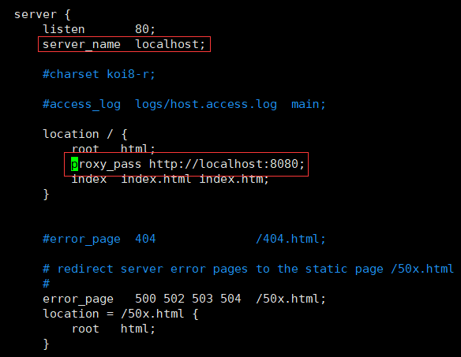
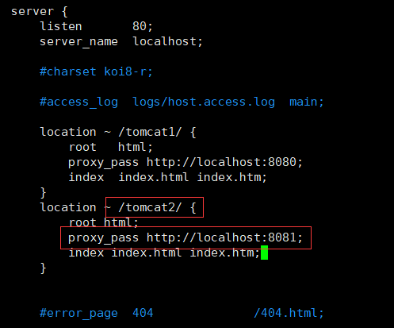
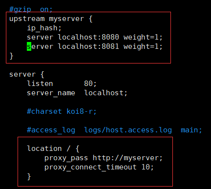

*注:以centos7.6为例*

#### 安装

##### 1.yum安装

http://nginx.org/en/linux_packages.html#RHEL-CentOS

##### 2.下载安装

```
yum install pcre-devel zlib zlib-devel openssl openssl-devel gcc
./configure --prefix=/usr/local/nginx
make & make install
```

#### 反向代理



```properties
location [=|~|~*|^~] uri {

}
1.=:用于不含正则表达式的uri前，如果匹配成功，立即停止向下搜索并处理该请求
2.~:表示uri包含正则表达式，并且区分大小写
3.~*:表示uri包含正则表达式，并且不区分大小写
4。^~:用户不含正则表达式的uri前，要求 Nginx 服务器找到标识 uri 和请求字符串匹配度最高的 location 后，立即使用此 location 处理请求，而不再使用 location 块中的正则 uri 和请求字符串做匹配。
```



#### 负载均衡



##### 1.负载均衡策略

- 轮询(默认)

- weight

  ```
  upstream server_pool{ 
  server 192.168.5.21 weight=10; 
  server 192.168.5.22 weight=10; 
  }
  ```

- ip_hash

  ```
  upstream server_pool{ 
  ip_hash; 
  server 192.168.5.21:80; 
  server 192.168.5.22:80; 
  }
  ```

- fair 按后端响应时间来分配请求，响应时间短的优先分配

  ```
  upstream server_pool{ 
  server 192.168.5.21:80; 
  server 192.168.5.22:80; 
  fair; 
  }
  ```

#### 动静分离

autoindex on;

#### 实战-keepalived+nginx搭建高可用集群

```
yum -y install keepalived
systemctl start keepalived.service
1.修改keepalived配置文件
vim /etc/keepalived/keepalived.conf
global_defs {
 notification_email {
 acassen@firewall.loc
 failover@firewall.loc
 sysadmin@firewall.loc
 }
 notification_email_from Alexandre.Cassen@firewall.loc
 smtp_server 192.168.17.129
 smtp_connect_timeout 30
 router_id LVS_DEVEL
}
vrrp_script chk_http_port {
 script "/usr/local/src/nginx_check.sh"
 interval 2 #（检测脚本执行的间隔）
 weight 2
}
vrrp_instance VI_1 {
 state BACKUP # 备份服务器上将 MASTER 改为 BACKUP 
 interface ens33 //网卡
 virtual_router_id 51 # 主、备机的 virtual_router_id 必须相同
 priority 90 # 主、备机取不同的优先级，主机值较大，备份机值较小
 advert_int 1
 authentication { 
 auth_type PASS 
 auth_pass 1111 
 } 
 virtual_ipaddress { 
 192.168.17.50 // VRRP H 虚拟地址 
 }
}
2.在/usr/local/src 添加检测脚本
#!/bin/bash
A=`ps -C nginx –no-header |wc -l`
if [ $A -eq 0 ];then
 /usr/local/nginx/sbin/nginx
 sleep 2
 if [ `ps -C nginx --no-header |wc -l` -eq 0 ];then
 killall keepalived
 fi
fi
```


