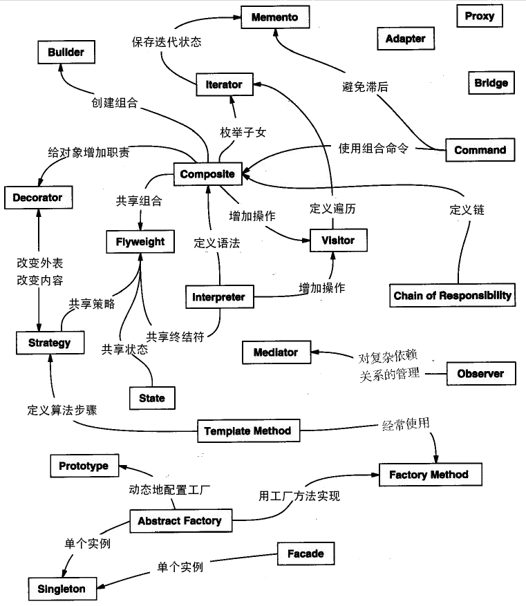

#### 设计模式

##### 1.介绍

设计模式的本质是面向对象设计原则的实际运用，是对类的封装性、继承性和多态性以及类的关联关系和组合关系的充分理解。

##### 2.分类

**根据目的来分：**

**创建型模式：**单例-Singleton，原型-Prototype，工厂方法-FactoryMethod，抽象工厂-AbstractFactory，建造者-Builder -- 5种

**结构型模式：**代理，适配器，桥接，装饰，外观，享元，组合 -- 7种

**行为型模式：**模板方法，策略，命令，责任链，状态，观察者，中介者，迭代器，访问者，备忘录，解释器 -- 11种

**根据作用范围来分：**

**类模式：**工厂方法，适配器，模板方法，解释器

**对象模式：**其他设计模式

##### 3.23种设计模式简单介绍

```java
1.单例模式（Singleton）
某个类只能生成一个实例，该类提供了一个全局访问点供外部获取该实例，其拓展是有限多例模式。
2.原型模式（Prototype）
将一个对象作为原型，通过对其进行复制而克隆出多个和原型类似的新实例。
3.工厂方法（Factory Method）模式
定义一个用于创建产品的接口，由子类决定生产什么产品。
4.抽象工厂（AbstractFactory）模式
提供一个创建产品族的接口，其每个子类可以生产一系列相关的产品。
5.建造者（Builder）模式
将一个复杂对象分解成多个相对简单的部分，然后根据不同需要分别创建它们，最后构建成该复杂对象。
6.代理（Proxy）模式
为某对象提供一种代理以控制对该对象的访问。即客户端通过代理间接地访问该对象，从而限制、增强或修改该对象的一些特性。
7.适配器（Adapter）模式
将一个类的接口转换成客户希望的另外一个接口，使得原本由于接口不兼容而不能一起工作的那些类能一起工作。
8.桥接（Bridge）模式
将抽象与实现分离，使它们可以独立变化。它是用组合关系代替继承关系来实现，从而降低了抽象和实现这两个可变维度的耦合度。
9.装饰（Decorator）模式
动态的给对象增加一些职责，即增加其额外的功能。
10.外观（Facade）模式
为多个复杂的子系统提供一个一致的接口，使这些子系统更加容易被访问。
11.享元（Flyweight）模式
运用共享技术来有效地支持大量细粒度对象的复用。
12.组合（Composite）模式
将对象组合成树状层次结构，使用户对单个对象和组合对象具有一致的访问性。
13.模板方法（TemplateMethod）模式
定义一个操作中的算法骨架，而将算法的一些步骤延迟到子类中，使得子类可以不改变该算法结构的情况下重定义该算法的某些特定步骤。
14.策略（Strategy）模式
定义了一系列算法，并将每个算法封装起来，使它们可以相互替换，且算法的改变不会影响使用算法的客户。
15.命令（Command）模式
将一个请求封装为一个对象，使发出请求的责任和执行请求的责任分割开。
16.职责链（Chain of Responsibility）模式
把请求从链中的一个对象传到下一个对象，直到请求被响应为止。通过这种方式去除对象之间的耦合。
17.状态（State）模式
允许一个对象在其内部状态发生改变时改变其行为能力。
18.观察者（Observer）模式：多个对象间存在一对多关系，当一个对象发生改变时，把这种改变通知给其他多个对象，从而影响其他对象的行为。
19.中介者（Mediator）模式：定义一个中介对象来简化原有对象之间的交互关系，降低系统中对象间的耦合度，使原有对象之间不必相互了解。
20.迭代器（Iterator）模式：提供一种方法来顺序访问聚合对象中的一系列数据，而不暴露聚合对象的内部表示。
21.访问者（Visitor）模式：在不改变集合元素的前提下，为一个集合中的每个元素提供多种访问方式，即每个元素有多个访问者对象访问。
22.备忘录（Memento）模式：在不破坏封装性的前提下，获取并保存一个对象的内部状态，以便以后恢复它。
23.解释器（Interpreter）模式：提供如何定义语言的文法，以及对语言句子的解释方法，即解释器。
```



##### 4.软件设计的七种原则

**开闭原则：**Software entities should be open for extension，but closed for modification

**里氏替换原则：**Inheritance should ensure that any property proved about supertype objects also holds for subtype objects

里氏替换原则通俗来讲就是：子类可以扩展父类的功能，但不能改变父类原有的功能。也就是说：子类继承父类时，除添加新的方法完成新增功能外，尽量不要重写父类的方法。

**依赖倒置原则：**高层模块不应该依赖低层模块，两者都应该依赖其抽象；抽象不应该依赖细节，细节应该依赖抽象（High level modules shouldnot depend upon low level modules.Both should depend upon abstractions.Abstractions should not depend upon details. Details should depend upon abstractions）。其核心思想是：要面向接口编程，不要面向实现编程。

依赖倒置原则是实现开闭原则的重要途径之一

**单一职责原则：**单一职责原则规定一个类应该有且仅有一个引起它变化的原因，否则类应该被拆分（There should never be more than one reason for a class to change）。

**接口隔离原则：**要求程序员尽量将臃肿庞大的接口拆分成更小的和更具体的接口，

**迪米特法则：**Talk only to your immediate friends and not to strangers

**合成复用原则：**在软件复用时，要尽量先使用组合或者聚合等关联关系来实现，其次才考虑使用继承关系来实现。

| 设计原则     | 一句话归纳                                                   | 目的                                       |
| ------------ | ------------------------------------------------------------ | ------------------------------------------ |
| 开闭原则     | 对扩展开放，对修改关闭                                       | 降低维护带来的新风险                       |
| 依赖倒置原则 | 高层不应该依赖低层，要面向接口编程                           | 更利于代码结构的升级扩展                   |
| 单一职责原则 | 一个类只干一件事，实现类要单一                               | 便于理解，提高代码的可读性                 |
| 接口隔离原则 | 一个接口只干一件事，接口要精简单一                           | 功能解耦，高聚合、低耦合                   |
| 迪米特法则   | 不该知道的不要知道，一个类应该保持对其它对象最少的了解，降低耦合度 | 只和朋友交流，不和陌生人说话，减少代码臃肿 |
| 里氏替换原则 | 不要破坏继承体系，子类重写方法功能发生改变，不应该影响父类方法的含义 | 防止继承泛滥                               |
| 合成复用原则 | 尽量使用组合或者聚合关系实现代码复用，少使用继承             | 降低代码耦合                               |

